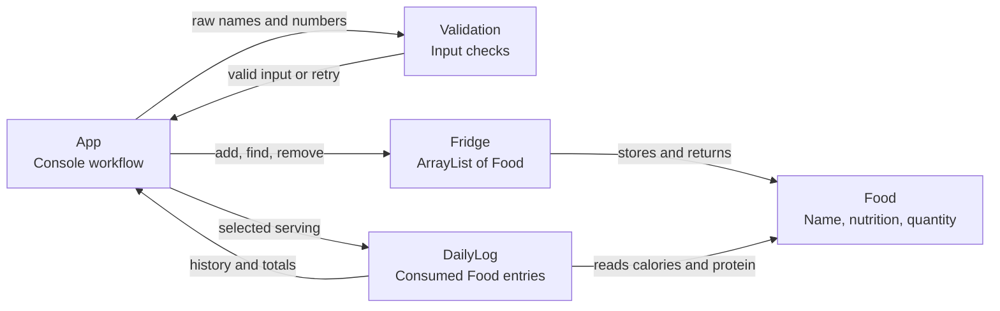

# Nutrition Tracker System Diagram

`App` coordinates the user workflow. `Validation` checks console input.
`Fridge` owns available food quantities, while `DailyLog` stores consumed food
entries and calculates daily nutrition totals.